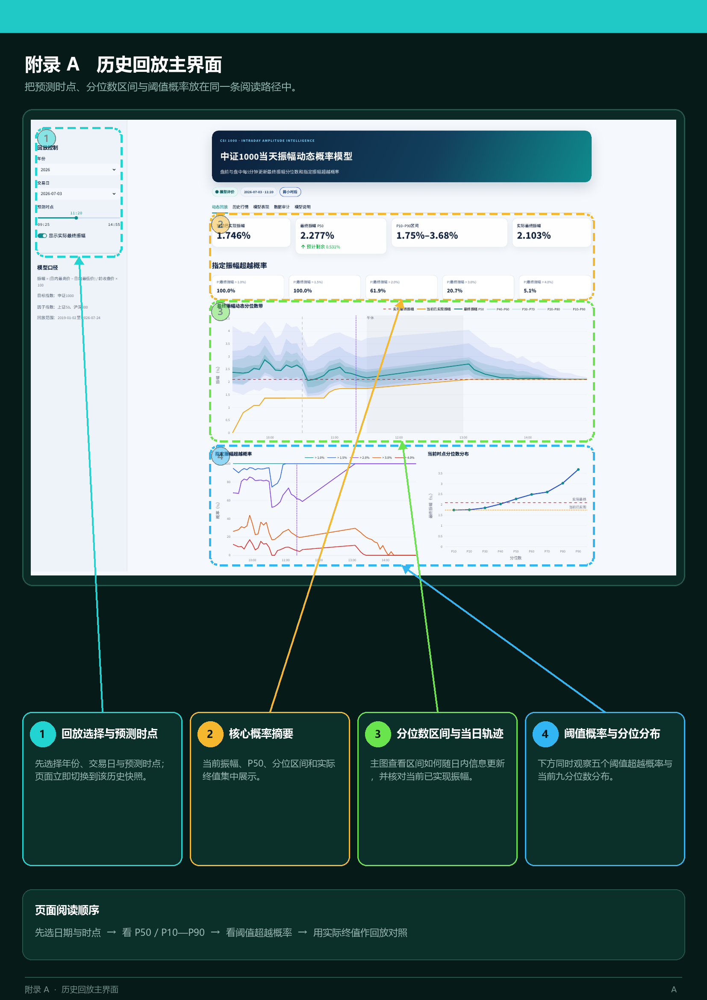

# 中证1000当天振幅动态概率模型 V4

目标指数为中证1000；上证50和沪深300只作为因子数据。模型使用2019—2025年训练数据，在盘前及盘中每5分钟输出：

- 最终振幅P10、P20、…、P90；
- 最终振幅中位数P50；
- 最终振幅超过1.0%、1.5%、2.0%、3.0%、4.0%的概率。

## 界面展示

<p align="center">
  
</p>

## 模型结构

模型包含三个时间路由，每个路由分别训练九个LightGBM条件分位数模型，共27个子模型：

| 路由 | 判断时点 | 说明 |
|---|---|---|
| 盘前 | `bar_index == 0` | 仅使用上一交易日及更早的历史滞后因子 |
| 开盘首小时 | `5 <= bar_index <= 60` | 09:35至10:30，每5分钟更新 |
| 首小时后 | `bar_index > 60` | 10:35至11:30及13:05至14:55，每5分钟更新 |

盘前路由明确排除当前日开盘价、当前日跳空、`cur_*`、`relative_*`和`bar_index`。

结构参数由各路由独立选择，选择指标为P10、P50、P90等权平均Pinball Loss。最终树数使用三个连续120交易日窗口的最佳树数中位数，早停有效改善阈值为`5e-5`。

## 目录

```text
v4/
├─ app.py                             Streamlit历史回放看板
├─ 启动可视化.bat                     双击启动看板
├─ start_dashboard.cmd                Windows实际启动入口
├─ 安装运行环境.bat                   首次安装依赖的双击入口
├─ setup_environment.cmd              本地运行环境安装入口
├─ artifacts/                         最终模型与历史回放预测
├─ config/                            最终参数与因子清单
├─ data/                              模型使用的六个原始CSV
├─ reports/                           数据审计、指标和预测结果
├─ scripts/
│  ├─ audit_data.py                   数据审计入口
│  ├─ train.py                        训练入口
│  ├─ predict.py                      批量预测入口
│  ├─ build_replay_data.py            生成历史回放数据
│  └─ run_dashboard.py                本地看板启动入口
├─ src/csi1000_v4/                    模型源码
├─ tests/                             必要单元测试
├─ environment.yml
└─ requirements.txt
```

模块职责：

| 导入名称 | 文件 | 用途 |
|---|---|---|
| `csi1000_v4.feature_pipeline` | `src/csi1000_v4/feature_pipeline.py` | 数据审计、1分钟数据处理、每5分钟特征快照构建 |
| `csi1000_v4.final_pipeline` | `src/csi1000_v4/final_pipeline.py` | 三路由训练、树数选择、模型保存、预测和评价 |

例如：

```python
from csi1000_v4.feature_pipeline import audit_inputs
```

表示从项目内部的`feature_pipeline.py`导入`audit_inputs`数据审计函数，不需要执行`pip install csi1000_v4`。

三个运行脚本会在启动时自动将V4内部的`src`目录加入Python模块搜索路径：

```python
V4_SRC = V4_ROOT / "src"
sys.path.insert(0, str(V4_SRC))
```

因此直接运行`scripts/train.py`、`scripts/predict.py`或`scripts/audit_data.py`即可。编辑器显示导入红线通常是编辑器没有把`src`配置为源码搜索目录，不影响脚本运行。

V4根目录已经提供`pyrightconfig.json`。使用VS Code时应直接打开V4目录作为工作区，并选择对应的Python环境，Pylance即可识别该内部包。

## 输入数据

已经在V4内部的`data`目录：

```text
CSI1000_daily_amplitude_20190102_20260724.csv
000852_1m_20190101_latest.csv
SSE50_daily.csv
SSE50_1m.csv
CSI300_daily.csv
CSI300_1m.csv
```

## 运行环境

当前环境：

```text
Python        3.9.25
LightGBM      4.6.0
NumPy         2.0.2
pandas        2.3.3
scikit-learn  1.6.1
joblib        1.5.3
Streamlit     1.42.2
Plotly        6.0.1
```

以上是外部依赖；`csi1000_v4`是交付目录自带的内部包。

启动器不依赖固定盘符，会依次寻找V4内部的`runtime_env`、当前虚拟环境、Conda中的`py39`或`csi1000-v4`环境，以及系统可用的Python。启动前会自动检查所需依赖。

## 可视化历史回放

双击V4根目录的：

```text
启动可视化.bat
```

如果首次启动提示缺少Python或依赖，双击一次：

```text
安装运行环境.bat
```

该脚本会在V4内部创建`runtime_env`，不依赖电脑上的固定安装路径。安装过程需要能够访问Python软件源；电脑上需要已有Miniconda或Python 3.9。环境安装完成后再次双击`启动可视化.bat`。

浏览器会打开本地Streamlit页面。页面加载现有最终模型及已经生成的历史回放预测，不执行实时预测，也不重新训练。可选择2019-01-02至2026-07-24任一交易日，并按48个时点查看：

- 当前已实现振幅；
- 最终振幅P10至P90区间及P50；
- 最终振幅超过1.0%、1.5%、2.0%、3.0%、4.0%的概率；
- 当日实际最终振幅及动态预测轨迹；
- 历史行情、模型评价、数据审计和模型说明。

也可在V4目录内通过命令启动：

```powershell
python scripts\run_dashboard.py
```

历史回放数据文件为`artifacts/historical_replay_predictions.joblib`，由最终模型统一生成。如需从六个原始CSV重新构建：

```powershell
python scripts\build_replay_data.py --rebuild-features
```

## 运行

以下命令均可直接在V4目录内执行

数据审计：

```powershell
python scripts\audit_data.py
```

按已锁定的最终结构和多窗口树数重训：

```powershell
python scripts\train.py
```

完整重新计算三个历史窗口的树数后训练：

```powershell
python scripts\train.py --reselect-iterations
```

使用已有特征面板预测指定日期：

```powershell
python scripts\predict.py `
  --feature-file <特征面板.pkl> `
  --date 2026-07-24 `
  --output reports\latest_predictions.csv
```

从原始CSV构建研究批量特征并预测：

```powershell
python scripts\predict.py `
  --date 2026-07-24 `
  --output reports\latest_predictions.csv
```

`train.py`、`audit_data.py`和`predict.py`默认都使用V4内部的`data`目录，也可以通过`--data-dir`显式指定其他目录。

首次从原始CSV运行时会在`artifacts`生成`feature_panel_cache.pkl`以加快后续训练和预测。该文件可随时由六个CSV重建，因此未放入当前交付目录。

## 主要输出

- `artifacts/csi1000_v4_final_model.joblib`：最终模型包；
- `artifacts/historical_replay_predictions.joblib`：2019—2026年历史回放预测；
- `reports/data_audit.csv`：数据审计；
- `reports/model_summary.csv`：总体评价；
- `reports/route_metrics.csv`：分路由评价；
- `reports/quantile_metrics.csv`：逐分位数评价；
- `reports/selected_configuration.csv`：最终结构参数；
- `reports/tree_iteration_selection.csv`：最终树数；
- `reports/feature_manifest.csv`：分路由因子清单；
- `reports/latest_predictions.csv`：示例预测结果。

模型使用分位数CDF线性插值计算指定振幅的超越概率；阈值位于P10—P90之外时使用相邻分位数斜率进行尾部外推，并限制概率在0至1之间。

详细模型与数据结果见[MODEL_REPORT.md](MODEL_REPORT.md)。
